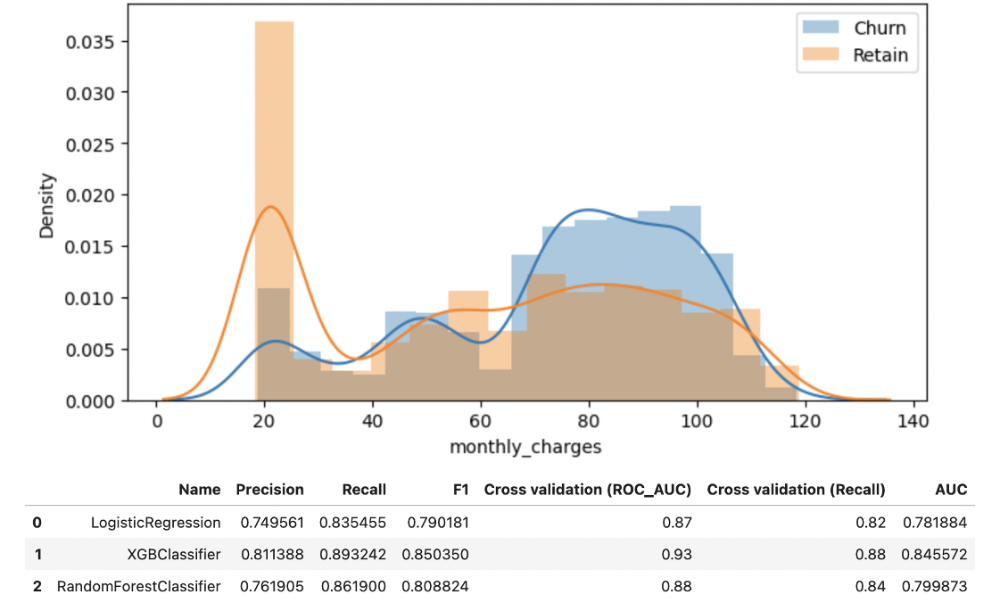
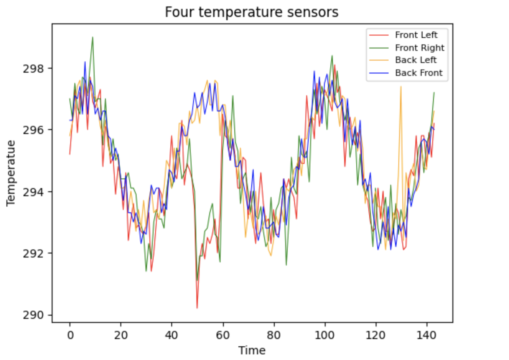
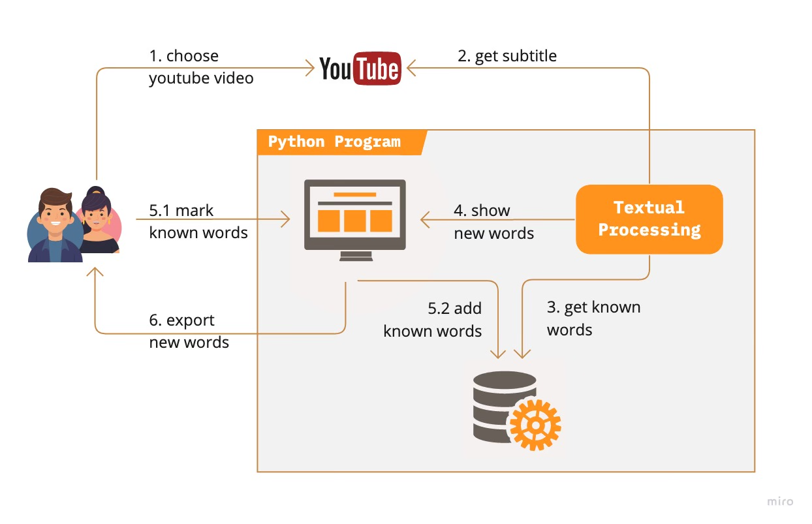
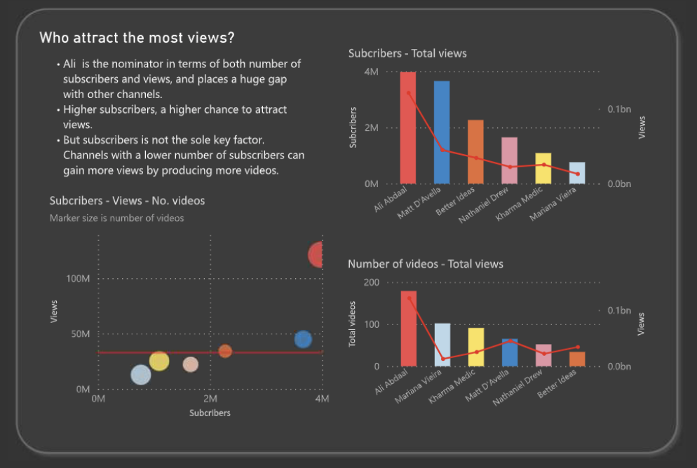

# Portfolio
---
## Machine Learning

### Customer Churn Detection

I performed comprehensive EDA to identify the portrait of a churned customer, handled missing values, performed feature engineering, and implemented different classification models to predict churned customers, executed model validation to compare the performance of these models.

---
### Anomaly Detection using Kmean++

 I implemented PCA to reduce dimensions for better interpretation, and applied Kmean++ to identify the abnormal cluster in temperature sensors data. Compared Elbow and Silhouette scores to choose the optimal number of clusters. 

---
## Daily Data Science

### Utilizing Natural Language Processing to filter new vocabularies from a Youtube'substitle 

I built a program to facilitate my English learning journey by crawling subtitles from Youtube videos, utilizing NLP to do text preprocessing, and developing a graphic user interface to offer solutions to interact with my program. 

---
### Identify who is the most productive productivity-Youtubers

After using Python to get data from YouTube API, I start doing EDA analysis in PowerBI to answer my curiosity: Who is the most productive productivity-YouTubers?

---

<a href="[https://github.com/chriskhanhtran](https://github.com/chriskhanhtran/minimal-portfolio)">Template Source</a>

